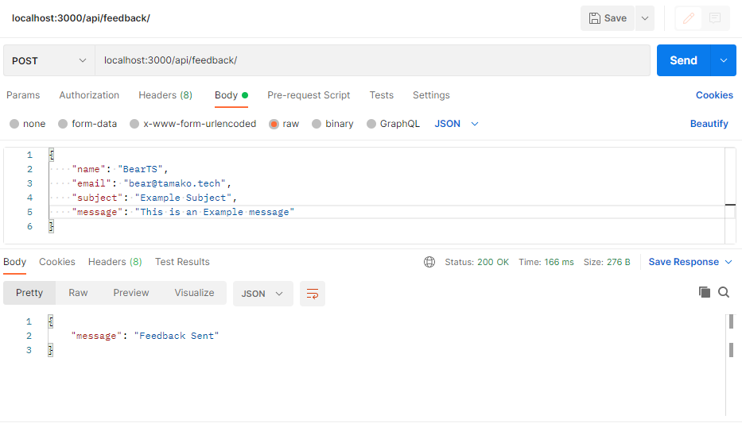
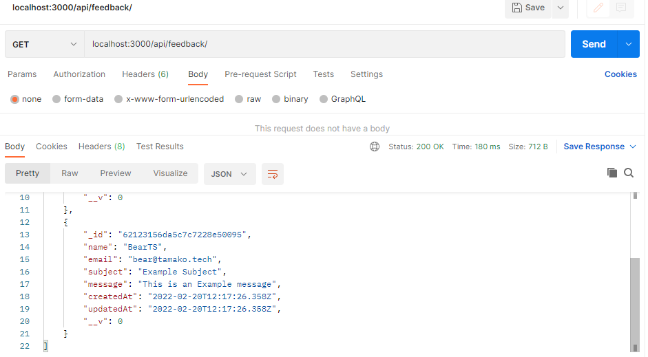
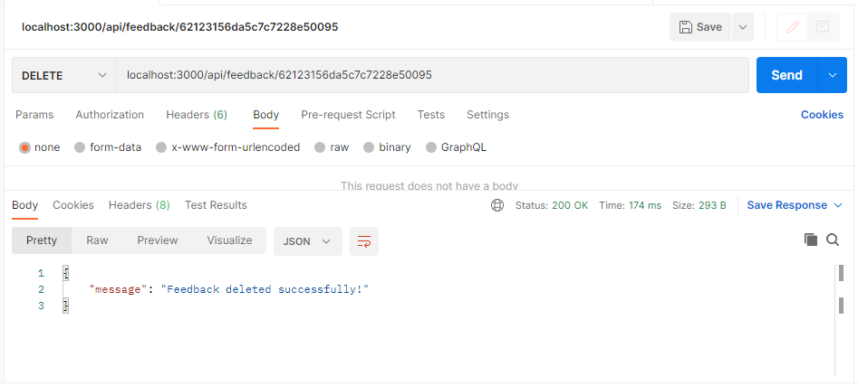

# Feedback API
Quick and Simple Backend API for Feedback in NodeJS 

## Features 
- Beginner friendly
- Easy to Use

## To DO
- [ ] Create a frontend website 
- [x] Addition Of Docker
- [x] Create Basic Functions

## Screenshots

